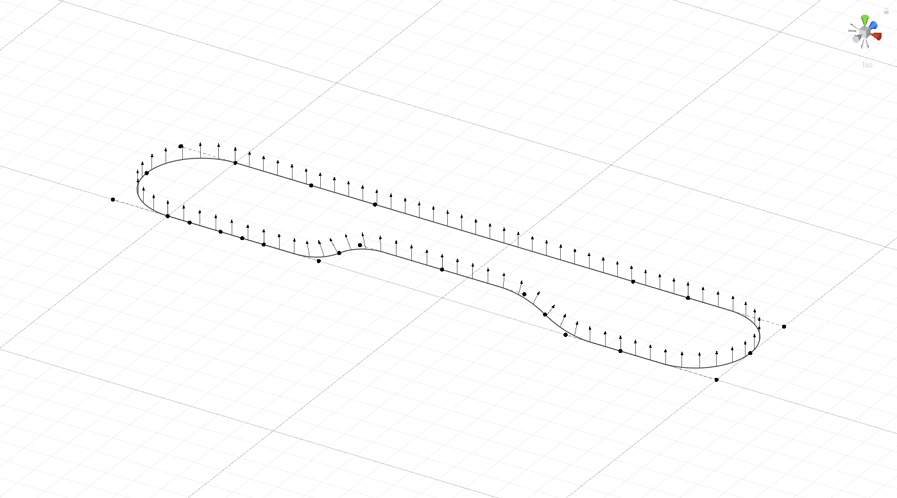

# Circular
Circular is a Unity (2019.4.29f1) example project, where it showcased construction of path using arcs and biarcs.

```
ATTENTION: Code requires refactoring and small fixes, - i'm working on it.
```



## Arc
Using three points, `origin`, `tangent` and `destination` we are able to construct an `Arc`. Below is an example of creating and rendering one using `UnityEditor.Handles`.
```csharp
void OnDrawGizmos ()
{
	Arc arc = new Arc();
	arc.Initialize(origin, tangent, destination);

	float lineWidth = 3.0f;
	int countSegments = 64;
	Vector3[] vertices = new Vector3[countSegments];

	float distanceOnArc = 0.0f;
	float delta = arc.totalLength / (float)(countSegments - 1);

	for (int n = 0; n < countSegments; n++)
	{
		vertices[n] = arc.GetPoint(distanceOnArc);
		distanceOnArc += delta;
	}

	Handles.color = Color.black;
	Handles.DrawAAPolyline(lineWidth, vertices);
}
```

### Arc methods:
```csharp
// Returns point on arc for a given distance on arc.
Vector3 GetPoint(float distanceOnArc);

// Returns distance on arc for a given point on arc.
float GetDistanceAtPoint(Vector3 pointOnArc);

// Returns direction, perpendicular to normal plane of arc at point and distance on arc.
Vector3 GetPerpendicular(Vector3 pointOnArc, float distanceOnArc);

// Returns direction along the path at given point and distance on arc.
Vector3 GetDirection(Vector3 pointOnArc, float distanceOnArc);

// Returns point on arc, that is closest to a given point on plane.
Vector3 GetNearestPointOnPlane(Vector3 pointOnPlane);

// Finds closest point on arc itself, which is closest to a given point on plane.
bool GetClosestPointOnArc(Vector3 pointOnPlane, out Vector3 pointOnArc);

// Calculates tangent points at specified distance on arc. Note, that calculated tangents are positions and not directions.
void GetTangent(Vector3 pointOnArc, float distanceOnArc, out Vector3 leftTangent, out Vector3 rightTangent);

// Splits arc into two at specified distance on arc.
void Split(float distanceOnArc, out Arc left, out Arc right);
```

### Arc properties:
```csharp
// Points
Vector3 origin, tangent, destination;

// Total length of arc from origin to destination
float totalLength;

// Length from origin to left extent
float leftExtentLength;

// Length from destination to right extent
float rightExtentLength;

// Length of arc
float arcLength;
```

---

## Biarc
Biarc is almost like two arcs, but with two points, that can lie only between two tangents of biarc. Below is an example of creating and rendering one.
```csharp
void OnDrawGizmos ()
{
	Biarc biarc = new Biarc();
	biarc.Initialize(
		this.transform.origin.position,
		this.transform.leftTangent.position,
		this.transform.leftMidpoint.position,
		this.transform.rightMidpoint.position,
		this.transform.rightTangent.position,
		this.transform.destination.position
	);

	this.transform.leftMidpoint.position = biarc.leftMidpoint;
	this.transform.rightMidpoint.position = biarc.rightMidpoint;

	float lineWidth = 3.0f;
	int countSegments = 64;
	Vector3[] vertices = new Vector3[countSegments];

	float distanceOnBiarc = 0.0f;
	float delta = biarc.totalLength / (float)(countSegments - 1);

	for (int n = 0; n < countSegments; n++)
	{
		vertices[n] = biarc.GetPoint(distanceOnBiarc);
		distanceOnBiarc += delta;
	}

	Handles.color = Color.black;
	Handles.DrawAAPolyline(lineWidth, vertices);
}
```


### Biarc methods:
```csharp
// Adjusts position of midpoints, so that they lie between tangents and do not cross each other.
void AdjustMidpoints();

// Returns point on Biarc for a given distance.
Vector3 GetPoint(float distanceOnBiarc);

// Returns point on biarc, that is closest to a given point on plane.
void GetNearestPoint(Vector3 pointOnPlane, out Vector3 pointOnBiarc, out float distanceOnBiarc);

// Splits Biarc into two at specified distance on Biarc.
void Split(Vector3 pointOnBiarc, float distanceOnBiarc, out Biarc leftBiarc, out Biarc rightBiarc);

// Calculates tangent points at specified distance on biarc. Note, that calculated tangents are positions and not directions.
void GetTangent(Vector3 pointOnBiarc, float distanceOnBiarc, out Vector3 leftTangent, out Vector3 rightTangent);

// Returns direction along the path at given point and distance on biarc.
Vector3 GetDirection(Vector3 pointOnBiarc, float distanceOnBiarc);

// Returns direction, perpendicular to normal plane of Biarc at point and distance on Biarc. Depending on where point is (left or right arc), it will use different normal plane and thus will have different perpendicular.
Vector3 GetPerpendicular(Vector3 pointOnBiarc, float distanceOnBiarc);
```

### Biarc properties:
```csharp
// Points
Vector3 origin, leftTangent, leftMidpoint, rightMidpoint, rightTangent, destination;

// Behaviour for each midpoint (details below)
MidpointBehaviour leftMidpointBehaviour;
MidpointBehaviour rightMidpointBehaviour;

// Offset for each midpoint (details below)
float leftMidpointOffset;
float rightMidpointOffset;

// Total length of biarc from origin to destination
float totalLength;

// Length/distance from left midpoint to right midpoint
float midpointsLength;
```

### Midpoints
Midpoints have `behaviour` and `offset`. If we want to set biarc midpoints to always stay at the middle between tangents, we could set `MidpointBehaviour.stayAtMiddle`. When we want for midpoint to stay at certain distance from it's tangent, we could set `MidpointBehaviour.offsetFromTangent` and specify `offset`. By default behaviour is set to `auto`.

---

## PathEditor
`PathEditor` is a custom Unity editor design to work with `PathComponent`. This component contains `Path`, which acts as a container for list of biarcs and samples (more on them below). Biarcs are stored in local space and transformed by `Transform` of `PathComponent`.

If you will do you your own custom editor, it is important to invoke `Path.Initialize()` before working with biarcs or samples.

### Tangents
Tangents have property called `CotangentBehaviour` which helps them configure cotangent of the node they are attached to. 

It can be `manual`, when no adjustment is done to cotangent. For cases, when we want to keep magnitude of cotangent, but change it's direction, we would use `keepMagnitudeAdjustDirection`.

Addition case `exactCotangent` will make so, that both tangents of node will be the same magnitude, but opposite directions.

### Samples
Besides biarcs, `Path` contains so called samples. Each sample, is a point at path, that contains `color` and `tilt`. When path has more than one sample, it will find two nearest samples to `distanceOnPath` and interpolate `color` and `tilt`. Sometimes, it is important for sample to stay at certain position, for example on the middle of the arc, for this kind of situations, samples have `AnchorPosition`, which helps `PathEditor` to identify where to put sample after user changes path.

---

## Remarks
- Some names, like `MidpointBehaviour` or `AnchorPosition`, might be renamed, if i find more accurate and shorter name;
- `PathEditor` at this moment is large file, with almost no comments. Some parts of code, are the way they are because of the past experimentation and currently awaiting refactoring;
- There are few demos i would like to make, to showcase usage of arcs in different areas;
- Currently, `PathEditor` is using `Quaternion.LookRotation`, and it works fine, until you want to make roller coaster. I think i will be able to find a solution only after i will start working on railroad project;

---

## About
Main purpose of this repository is to serve a starting point for those who seek to implement a library with help of which they will be able to construct a path using circular arcs and lines.

In my opinion each project has it's quirks, requirements and restrictions, and while i think it's possible to create universal library, i do not have that much experience and understanding at this moment. I've started this project somewhere in August of 2021. What i wanted to achieve is an alternative to splines, which can be used to construct roads and railways. Splines are cool, but i wanted perfect circles and arcs where i need them, so here we are.

---

## Patreon
If you wish to support my adventure or express your gratitude, i have a [Patreon](https://www.patreon.com/kallisto56).